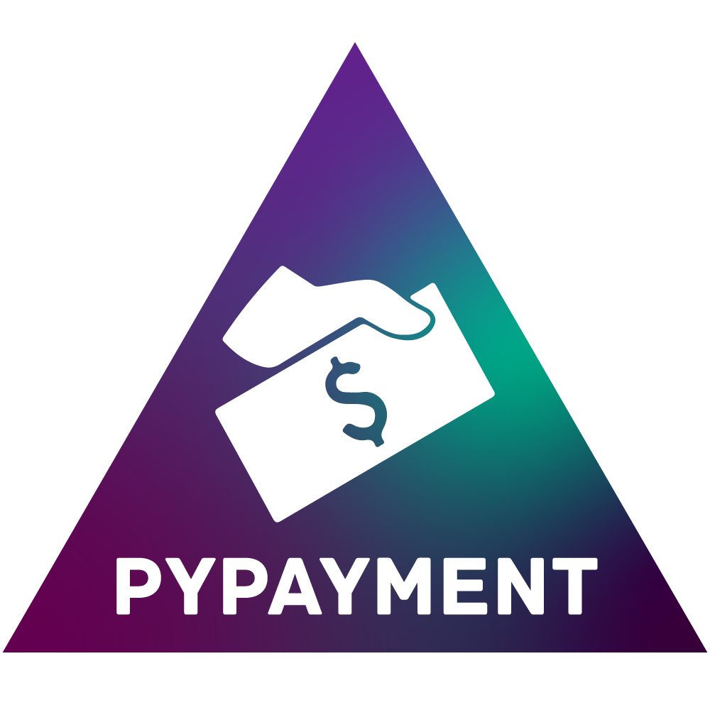

<h1 align="center">
  <br>
  </a>
  <br>
  PyPayment
  <br>
</h1>

<h4 align="center">Payment providers API wrapper</h4>

<p class="badges" align="center">
    
    
    
    <a href="https://deepsource.io/gh/TimNekk/pypayment/?ref=repository-badge}" target="_blank"></a>
</p>

<p align="center">
  <a href="https://pypayment.readthedocs.io">Documentation</a> •
  <a href="#providers">Providers</a> •
  <a href="#installation">Installation</a> •
  <a href="#quickstart">Quickstart</a> •
  <a href="#contributing">Contributing</a> •
  <a href="#license">License</a>
</p>

**PyPayment** is a Python wrapper for API of different payment providers. 
It is designed to be a simple and easy to use library for developers to integrate payment into their applications.

Main idea is to provide a unified interface for different payment providers.

For more details see [documentation](https://pypayment.readthedocs.io).

## Providers:
- [Qiwi P2P](https://p2p.qiwi.com/)
- [YooMoney](https://yoomoney.ru/)
- [PayOk](https://payok.io/)
- [BetaTransfer](https://betatransfer.io/)
- [Lava](https://lava.kz/) *(under development)*
## Installation

Install the current version with [PyPI](https://pypi.org/project/pypayment/)

```bash
pip install -U pypayment
```

## Quickstart

Choose payment provider and authorize. For example, for Qiwi

```python
from pypayment import QiwiPayment

QiwiPayment.authorize("my_secret_key")
```

Create a payment and get it's `url`

```python
from pypayment import Payment, QiwiPayment

payment: Payment = QiwiPayment(amount=100) # E.x. commission is 10%

print(payment.url)  # https://oplata.qiwi.com/form/?invoice_uid=payment_unique_id
```

Wait for payment to be completed and get it's income

Use `update()` method to update payment's `status` and `income`

```python
from pypayment import PaymentStatus

while payment.status != PaymentStatus.PAID:
    input("Press Enter to update payment status and income")
    payment.update()

print("Payment is completed!")
print(payment.income)  # 90.0
```

Summary

```python
from pypayment import Payment, QiwiPayment, PaymentStatus

QiwiPayment.authorize("my_secret_key")

payment: Payment = QiwiPayment(amount=100) # E.x. commission is 10%
print(payment.url)  # https://oplata.qiwi.com/form/?invoice_uid=payment_unique_id

while payment.status != PaymentStatus.PAID:
    input("Press Enter to update payment status")
    payment.update()

print("Payment is completed!")
print(payment.income)  # 90.0
```

## Contributing

Bug reports and/or pull requests are welcome


## License

The module is available as open source under the terms of the [Apache License, Version 2.0](https://opensource.org/licenses/Apache-2.0)
