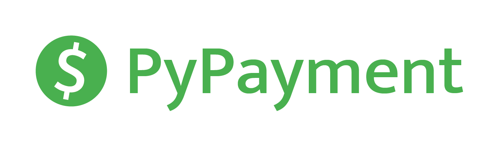

<div align="center">
    
    <p><em>Unified Interface for Payment APIs</em></p>
    <div>
        <a href="https://pypi.org/project/pypayment/" target="_blank"></a>
        <a href="https://www.python.org/" target="_blank"></a>
        <a href="https://github.com/TimNekk/PyPayment/blob/main/.github/workflows/lint.yml" target="_blank"></a>
        <a href="https://github.com/astral-sh/ruff" target="_blank"></a>
        <a href="https://gitmoji.dev" target="_blank"></a>
    </div>
</div>


---

**Documentation**: <a href="https://timnekk.github.io/PyPayment/" target="_blank">https://timnekk.github.io/PyPayment/</a>

**Source Code**: <a href="https://github.com/TimNekk/PyPayment" target="_blank">https://github.com/TimNekk/PyPayment</a>

---

**PyPayment** is a wrapper for payment provider APIs

> Main idea – **unified interface** for every provider

This library simplifies payment integration

### Supported Providers

- [Qiwi P2P](https://p2p.qiwi.com/)
- [YooMoney](https://yoomoney.ru/)
- [PayOk](https://payok.online/)
- [BetaTransfer](https://betatransfer.io/)
- [Aaio](https://aaio.so/)
- [Lava](https://lava.kz/)

## Installation

Install the latest version with [PyPI](https://pypi.org/project/pypayment/)

```bash
pip install -U pypayment
```

## Quickstart

```python
# Choose payment provider. For example, Qiwi
from pypayment import Payment, QiwiPayment, PaymentStatus

# Authorize payment provider
QiwiPayment.authorize("my_secret_key")

# Create a payment and get its url
payment: Payment = QiwiPayment(amount=100)
print(payment.url)  # https://oplata.qiwi.com/form/?invoice_uid=<payment_unique_id>

# Wait for payment to be completed
while payment.status != PaymentStatus.PAID:
    input("Press Enter to update payment status...")

    # Use `update()` method to update payment's `status` and `income`
    payment.update()

print("Payment is completed!")
print(payment.income)  # 90.0 (if commission is 10%)
```

> [!NOTE]
> For more details see [documentation](https://timnekk.github.io/PyPayment/)

## Contributing

**Contributions are welcome! Here's how you can help:**

1. Fork it
2. Create your feature branch
3. Commit your changes
4. Push to the branch
5. Create a new Pull Request
6. Get your code reviewed
7. Merge your code
8. Get a 🌟

## License

This project is licensed under the MIT License - see the [LICENSE](LICENSE) file for details